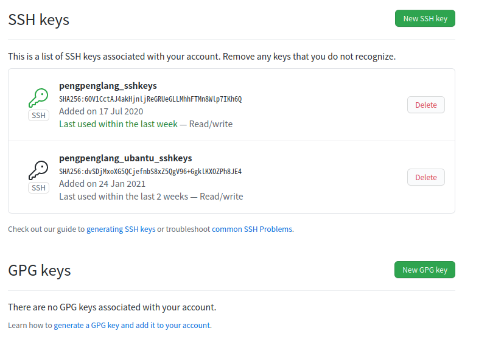
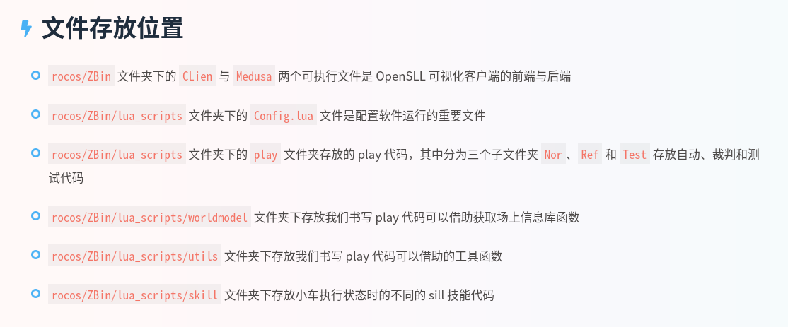

# 食用说明

这里主要是给大家简述一下本人对照视频与课程学习安装配置 `rocos` 的过程~~（反反复复安装了 N 遍 😭）~~以及总结的经验，避免大家走过多的弯路，另外再介绍一些本人经过为期一周的折腾后对于  `ubantu` 系统基本操作的了解和一些便于大家开发的美化改造，希望对大家起到一些帮助

> 到目前为止默认应该每个人都成功安装了 `ubantu18.03`，如果还没有那么先找浩中帮忙吧，我的也是麻烦他帮助安装的 😝，另外文档中可能存在问题还请大家谅解毕竟本人也是假期边划水边磨进度，对于该系统还是摸索中，可能多多少少还难免忘了一些环节

课程中安装介绍的顺序有点问题，其实有两种方法：

* **第二种方法（对应课程第五节）是那个程序员用新的 `ubantu18.03` 从零开始安装讲解的，先对着那个尝试安装，如果那个成功安装了那是最好不过的了，如果安装成功了那就没必要看这篇文档了**

* 如果不行那就按照课程前面几节的视频来安装（不用慌我是按照这种方法成功的），强烈建议对着B站视频和文档安装，下面也就是一些我安装遇到问题解决的办法和提醒，视频链接是[B站的南江乐博官方的账号视频](https://space.bilibili.com/298653126?from=search&seid=8366606469934150358)，也给出[客户端使用指南](https://rocos.readthedocs.io/zh_CN/latest/3_how_to_use.html#id6)

这里我分为两个部分介绍：

* 关于安装配置的进一步解释与帮助，主要还是需要看视频和文档
* 关于一些插件软件的安装，这个看个人选择吧，本人喜欢多瞎折腾一些就分享给大家

# 安装配置

## 常用操作介绍

1. 输指令需要打开终端快捷键 `ctrl+alt+T`
2. 查看当前文件加下的文件指令 `ll` 或者 `ls`
3. 进入某个文件夹用 `cd`
4. 运行某个可执行文件 `./文件名`
5. 有的指令可能权限不够那就在指令前面加一个 `sudo`，然后指令执行的时候需要输入密码
6. `ubantu` 的图形化界面都是无管理员权限的，如果想从某个系统文件夹下删除或者移动文件需要借助 sudo 和 相应的指令，具体查看[说明文档](https://blog.csdn.net/sherry_rui/article/details/38411759)
7. 打开某个 txt 或者其他文件可以用 `gedit` 指令，具体查看[说明文档](https://www.dotcpp.com/course/352)
8. 想要下载其他的文件一是选择在“ubantu软件”中获取，但是应用很少，或者在官网下载 linux 版本

## git 远程仓库的使用

**官方文档文件夹下第一期文档有详细的介绍，建议先看那个**

> 个人最大的感受就是 `ubantu` 想要发挥高效操作的作用就需要熟练掌握终端指令的使用，而 `github` 不仅恰恰是使用指令可以帮助我们习惯这种操作并且以后大家多人协作可能也有用到

* 账号应该每个人之前就有了，就按找文档里的操作就好
* 安装打开终端用 `apt-get` 指令，这是 `ubantu` 安装应用的第一种方式也是最简单的，它相当于直接从官方源获取已经打包好的软件包，后续的安装能用的话首选这种方式
* 即使你的 `windows` 已经创建过 `ssh keys` 并添加到 `github` 账号中了但是还是需要在 `ubantu` 重新申请的，我现在是两个密令并且使用中仍未遇到过问题

* `github` 指令的学习不是一蹴而就的，可以在今后慢慢学习摸索，这里推荐两个本人觉得非常良心的学习网站，一是文档里也提到的[廖雪峰老师的git教程](https://www.liaoxuefeng.com/wiki/896043488029600)，另一个是国内码云团队做的[开源指北](https://gitee.com/opensource-guide/)

## `Client` 配置编译

**官方文档文件夹下第二期文档有详细的介绍，建议先看那个**

### 安装 Qt

> 这个主要是帮助我们第一次使用 `rocos` 将客户端的 C++ 源码编译获得可执行文件

* 这里用到了 `ubantu` 的第二种安装方式，从官网获取 `.run` 文件安装，其实就相当于 `win` 下获取 `.exe` 文件没什么好说的，安装直接双击就可以，如果不行可以尝试指令安装，具体查看[说明文档](https://blog.csdn.net/sinat_36330809/article/details/82620062?utm_medium=distribute.pc_relevant.none-task-blog-BlogCommendFromMachineLearnPai2-3.control&depth_1-utm_source=distribute.pc_relevant.none-task-blog-BlogCommendFromMachineLearnPai2-3.control)
* 安装步骤中可能还涉及到组件选择的问题，全选的话好像是 4个多G 我记得，因为太大了我就选了 C++ 的组件，目前也遇到什么问题

### 安装 zlib 和 Eigen3

* 应该没有什么问题，有的话上网查或者我帮忙解决一下，查了这么多文档我总结的一个小经验就是谷歌、`bing` 搜索或者 `stackoverflow`、博客园上查到的一般能够有效解决问题，从百度、`CSDN` 找的看似回答很多但是基本上都是无用或者互相转载的，建议看下发文日期再决定是否尝试

### 安装 Protobuf

* ==注意不要按照文档上的下载 protobuf，那样会安装高版本，看第三期文档最后红字警告明确了安装 3.9 版本的所以只能自己另寻方法安装==，我是按照这篇[说明文档](https://blog.csdn.net/awesomewan/article/details/106207763)成功安装的
* 杜老师给咱们拉近的机器人群文件里也有那个 `protobuf`，不过好像 `ubantu` 不能安装 QQ 😕 ，网上教程下载 `deepwine` 安装 QQ 的不用尝试了我都试过了，阿里云源链接已经失效了，实在需要从 QQ 获取目前我有两种方法：
  * 一是从“文件”进入“其他位置”，应该是能访问到 win 的硬盘的，你可以先用 win 下载然后放在指定位置然后再进入 `ubantu` 移动过来
  * 二是借助 QQ 邮箱，你可以先在 `win` 发给自己然后再进入 `ubantu` 收件
* ==学习通课程的资料了我看杜老师也上传了一些需要的文件大家也可以尝试一下，包括后面的安装可以先看看课程里有没有==
* 想知道有没有安装成功就查看一下电脑里的应用版本号，有显示想要的版本号就是成功，终端不认识指令就是没成功

### 安装 OpenGL 、Cmake 和 ODE

* Cmake 下载有点慢，因为是境外网站最好挂个梯子，杜老师课程里也分享过或者从火狐浏览器-附加组件-搜索 `setupvpn` 安装，免费的一个节点连接就可以了。另一种方法就是用手机的 UC、夸克这种强大的浏览器访问境外官网下载，速度也是比较快然后传给电脑就行了
* 上述文件都安装完然后就能将项目编译成功了， 如果 Medusa 那栏你也像我一样少一个控制小车的界面那也不影响后续开发

## `Medusa` 配置编译

**官方文档文件夹下第三期文档有详细的介绍，建议先看那个**

### 安装 lua 和 tolua

* 选择安装 5.1.4，不要安装 5.2 或者 5.3 等高版本！！

* 安装完之后编译 `Medusa` 还是会有问题执行一下那个脚本
* 如果你 Qt 报错好几百个全是关于 `protobuf` 的注意文档的红字，那么回头看看安装的是不是 `protobuf 3.9.1`，经实验本人 3.9.2 也完美运行

### 玩转 TestRun.lua

这期主要就是介绍怎么使用了，里面讲了一下 rocos 各个文件放置的位置，看 B站上的视频就好了，我大致总结了一下

# 插件美化

> 我是对照了好几片博客美化了很多，但是都很鸡肋没什么用这里只介绍有用的

## WPS 的安装

这个杜老师也又讲，在学习通课程中有讲解，不过我觉的 liberoffice 汉化还挺好的我目前还没尝试安装

## 搜狗输入法安装

`ubantu` 自带的这个输入法就是人工智障，搜狗输入法安装好很多，具体查看[安装文档](https://blog.csdn.net/fx_yzjy101/article/details/80243710)

## 更改 dock 位置

具体查看[安装文档](https://blog.csdn.net/qq_42527676/article/details/91356154)，另外还有什么给终端添加高亮主题，我这里就不多BB了需要的话可以搜索 oh-my-zsh 自行了解

## sublime 安装与配置

* 具体查看[安装文档](https://blog.51cto.com/xiumu/1766052)，安装的 `sublime3` 应该是未激活的英文版，而且写 lua 文件没有报错检查，我使用的是方法二安装成功的，激活码也有效
* 如果桌面没有 `sublime` 图标可以看[说明文档](https://blog.csdn.net/u012932409/article/details/105753282?utm_medium=distribute.pc_relevant.none-task-blog-BlogCommendFromBaidu-4.baidujs&depth_1-utm_source=distribute.pc_relevant.none-task-blog-BlogCommendFromBaidu-4.baidujs)
* `sublime` 亲测可用[注册码](https://www.cnblogs.com/mrgavin/p/12522560.html)
* `sublime` [汉化教程](https://blog.csdn.net/jiangnanqbey/article/details/81284771)
* `sublime`安装其他插件前提是安装 `package control` 插件，给出一个[最全的安装教程](https://blog.csdn.net/kongguyoulan523/article/details/51144254?utm_medium=distribute.pc_relevant.none-task-blog-BlogCommendFromMachineLearnPai2-2.control&depth_1-utm_source=distribute.pc_relevant.none-task-blog-BlogCommendFromMachineLearnPai2-2.control)
* 我觉的最有用的检查 `lua` 错误的[插件安装教程](https://www.cnblogs.com/cheerupforyou/p/6576861.html)
* 解决 linux 系统下 sublime 无法输入中文问题具体见[说明文档](https://blog.csdn.net/weixin_39382961/article/details/80148933)，解决办法会更新上述安装的 sublime 并且自动生成快捷方式

## `ubantu` 右键管理权限打开

`ubantu` 双击打开文件一般是只读的，只能借助 `gedit` 打开文件，或者安装一个右键管理权限打开功能，[配置](https://blog.csdn.net/m0_37794364/article/details/105171318)很简单

## `ubantu` 右键添加文本快捷键

`ubantu` 想要创建一个文本还是需要借助 `gedit` 创建文本，或者给右键再配置一个添加文本快捷键，[配置](https://www.kafan.cn/edu/20666192.html)也很简单