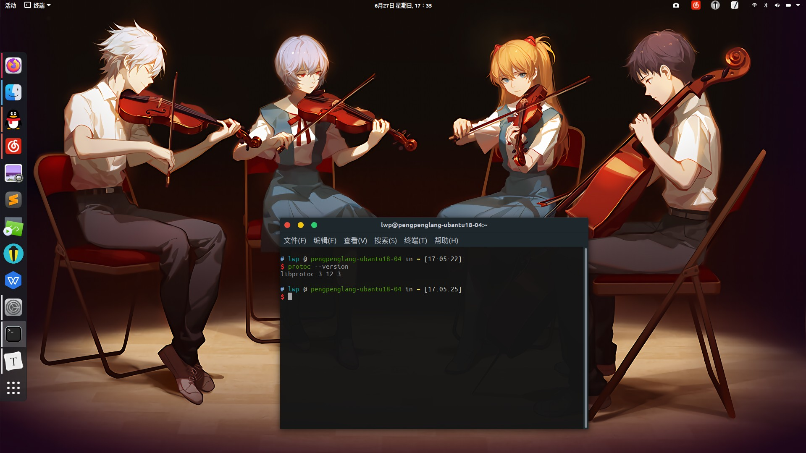

# 食用说明

ubantu 很丑？应用很难用？自给自足，丰衣足食！

下面分为两个部分，第一部分是进行开发必装应用，另一部分根据自己情况而定

## 开发必装

安装没有唯一的方法，网上有很多教程自己去找，如果这都不能独自完成，那还留在队里干什么呢？😅

### sublime3 编辑器

- 安装完成后可能是未注册版本，可以去网上找别人分享的注册码暂时性的破解
- sublime 开发 lua 可以自己去添加一下一个是语法随时检查插件
- sublime默认不支持中文注释所以需要上网找一下设置方法

### linux版 QQ

- [官网下载链接](https://im.qq.com/linuxqq/)，用于小组在 linux 开发时分享文件

### WPS 组件

先卸载 `ubantu` 自带的 liber office 组件再安装 WPS 组件安装

## 魔改选装

### 搜狗输入法

`ubantu` 自带的这个输入法就是人工智障，搜狗输入法安装好很多，具体查看[安装文档](https://blog.csdn.net/fx_yzjy101/article/details/80243710)

### 主题修改（包含更改 dock 位置）

具体查看[ubantu18.04主题修改完整版](https://blog.csdn.net/qq_42527676/article/details/91356154)

- 里面有什么给终端添加高亮主题，我这里就不多 BB 了需要的话可以搜索 oh-my-zsh 自行了解，但是需要注意安装 zashrc 代替 bashrc 可能导致 rocos 平台的崩溃，所以慎用除非你了解如何修改错误

> 但是是真的好康，所以打算学习 linux 或者苹果用户可以尝试

### `ubantu` 右键管理权限打开

`ubantu` 双击打开文件一般是只读的，只能借助 `gedit` 打开文件，或者安装一个右键管理权限打开功能，[配置](https://blog.csdn.net/m0_37794364/article/details/105171318)很简单

### `ubantu` 右键添加文本快捷键

`ubantu` 想要创建一个文本还是需要借助 `gedit` 创建文本，或者给右键再配置一个添加文本快捷键，[配置](https://www.kafan.cn/edu/20666192.html)也很简单

